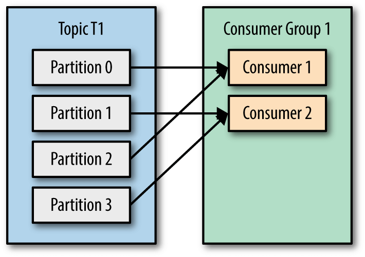
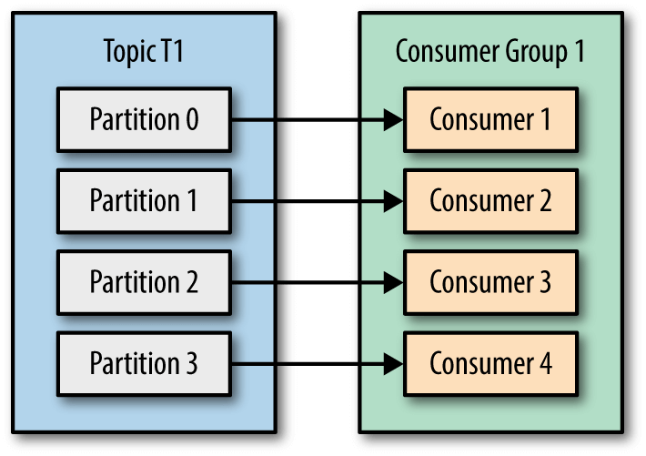
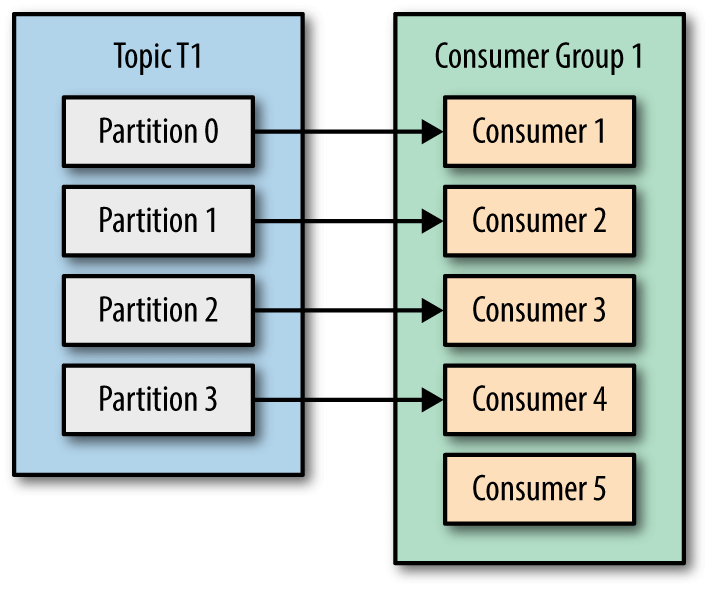

# FAQ
Some of questions are taken from: <https://stackoverflow.com/questions/38024514/understanding-kafka-topics-and-partitions>

## What is group ID? Should a consumer specify a group?
```
val properties = Properties()
properties[ConsumerConfig.GROUP_ID_CONFIG] = "<YOUR-GROUP-ID>"
return KafkaConsumer<String, String>(properties);
```
**group.id** is a must have property and here it is an arbitrary value.This value becomes important for kafka broker when we have a consumer group of a broker.With this group id, kafka broker ensures that the same message is not consumed more then once by a consumer group meaning a message can be only consumed by any one member a consumer group.   
You should always configure group.id unless you are using the simple assignment API and you don’t need to store offsets in Kafka.

## What is the difference between a single partition and multiple partitions?

## Does a producer care about partitions?
Producer will decide target partition to place any message, depending on:
- Partition id, if it's specified within the message
- key % num partitions, if no partition id is mentioned
- Round robin if neither partition id nor message key are available in a message, meaning only value is available

## Does each consumer group have a corresponding partition on the broker or does each consumer have one?
In one consumer group, each partition will be processed by one consumer only. These are the possible scenarios:
- Number of consumers is less than number of topic partitions then multiple partitions can be assigned to one of the consumer in the group.

- Number of consumers same as number of topic partitions, then partition and consumer mapping can be like below.
  
- Number of consumers is higher than number of topic partitions, then partition and consumer mapping can be as seen below, Not effective, check Consumer 5


**A consumer should be aware of the number of partitions!**

## Since this is a queue with an offset for each partition, is it responsibility of the consumer to specify which messages it wants to read? Does it need to save its state?
Kafka(to be specific Group Coordinator) takes care of the offset state by producing a message to an internal __consumer_offsets topic, this behavior can be configurable to manual as well by setting `enable.auto.commit` to `false`. In that case `consumer.commitSync()` and `consumer.commitAsync()` can be helpful for managing offset.

More about Group Coordinator:
- It's one of the elected broker in the cluster from Kafka server side.
- Consumers interact with Group Coordinator for offset commits and fetch requests.
- Consumer sends periodic heartbeats to Group Coordinator.

## What happens when a message is deleted from the queue? - For example: The retention was for 3 hours, then the time passes, how is the offset being handled on both sides?
If any consumer starts after retention period, messages will be consumed as per `auto.offset.reset` configuration which could be `latest/earliest`. Technically it's `latest`(start processing new messages) because all the messages got expired by that time and retention is topic level configuration.

## What is the retention policy for records?
If the log retention is set to five days, then the published message is available for consumption five days after it is published. The default retention time is 168 hours, i.e. 7 days.
