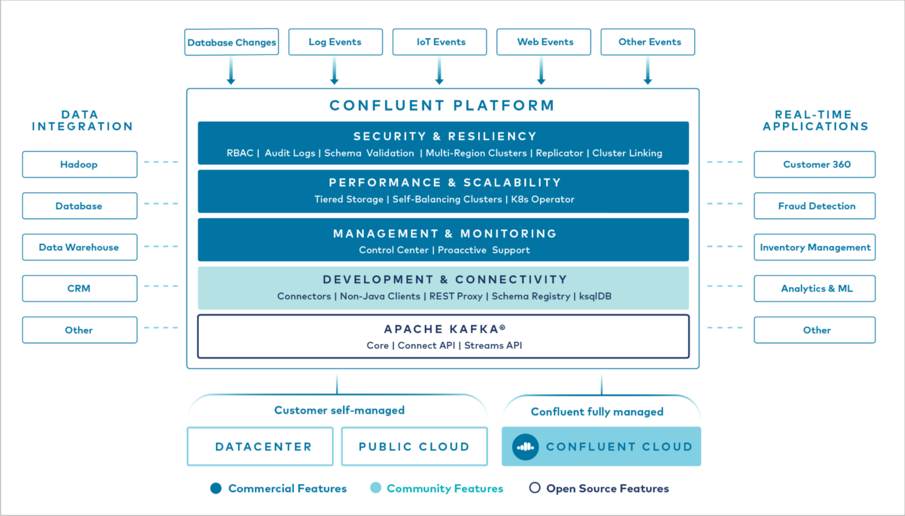
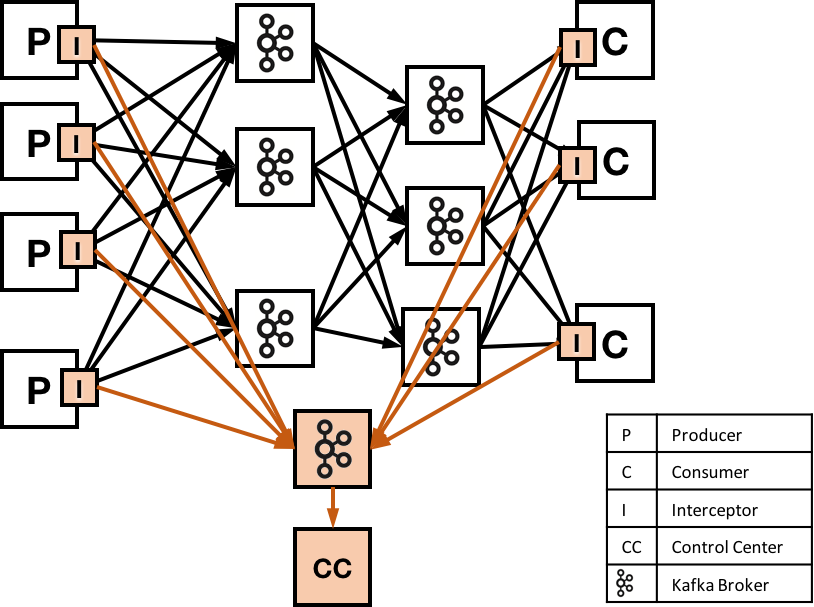

# Kafka local setup
Run Kafka and Zookeeper using Docker Compose/Kubernetes.  
You can choose between:
- `docker-compose.yml`
- `docker-compose-confluent-platform.yml`
- `kubernetes.yml`
    - docker-compose up -d
    - docker-compose -f docker-compose-cluster.yml up -d
// todo: add Kubernetes description

## Confluent Kafka Platform
The Confluent setup provides web UI for the whole Kafka platform.  
More information you can find in this guideline: <https://docs.confluent.io/platform/current/quickstart/ce-docker-quickstart.html>

[Reference link](https://docs.confluent.io/platform/current/platform.html)
- **Confluent Control Center** is a web-based tool for managing and monitoring Apache Kafka®. Control Center provides a user interface that allows developers and operators to get a quick overview of cluster health, observe and control messages, topics, and Schema Registry, and to develop and run ksqlDB queries. See more: <https://docs.confluent.io/platform/current/control-center/index.html>   
- **Confluent Schema Registry** provides a serving layer for your metadata. It provides a RESTful interface for storing and retrieving your Avro®, JSON Schema, and Protobuf schemas. See more: <https://docs.confluent.io/platform/current/schema-registry/index.html>
- **ksqlDB** is the streaming SQL engine for Kafka. It provides an easy-to-use yet powerful interactive SQL interface for stream processing on Kafka, without the need to write code in a programming language such as Java or Python.

## Docker and Docker Compose commands
If you don't use IDE plugins, here you can find useful Docker commands:
- Show all containers
    - `docker container list`
- Stop a Docker container
    - `docker container stop [container_id]`
- Remove a Docker container
    - `docker container rm [container_id]`
- Build Docker Compose with the default file docker-compose.yml and remove previous containers
    - `docker-compose up -d --remove-orphans`
- Show Docker Compose containers
    - `docker-compose ps`
