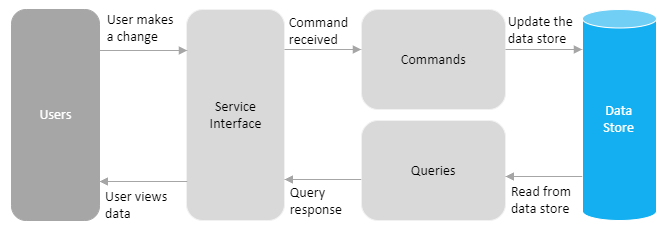
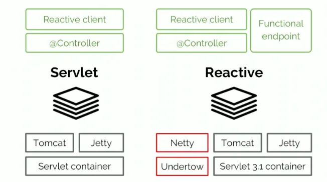
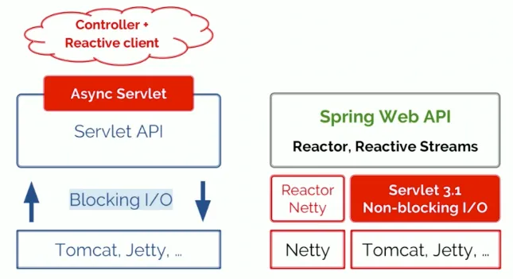
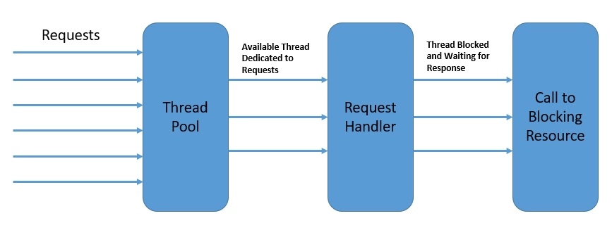
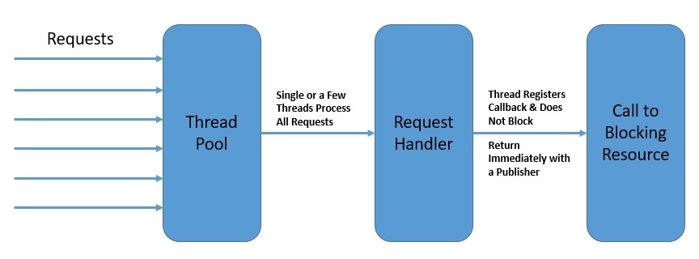

# CQRS and Event Sourcing

The example is based on a stores and products.
- The product can be added to the store.
- Number of available products can be changed.
- The list of available products can be retrieved.

## Technology
- Kotlin
- Spring Boot Reactive stack
- JDK 11 (AWS Corretto)

## CQS & CQRS & Event sourcing introduction

### Standard architecture (layered)

### CQS (Separate commands and queries)
Command-Query Separation (CQS) is a principle or guideline, used in a software architecture, that states that every method should either be a command that performs an action, or a query that returns data to the caller, but not both. Methods should return a value only if they create no side effects.

CQS is about Command and Queries. It doesn't care about the model. You have somehow separated services for reading data, and others for writing data.

CQS architecture reads and writes from the same data store/tables.

**Commands**  
A command is created when data is to be mutated. The following classes are needed for a command:
- A command class containing the properties required to mutate data, for example properties to create a new object.
- A command handler class to handle the business logic for the command and to handle mutation of the data store, for example CreateObjectCommandHandler is a class that handles the creation of a new object.
- A command response class to return to the caller. Note that a command response class is optional since not all commands will return a response. For example, CreateObjectCommandResponse is a class that contains the details of the newly created hero. 
- A command validator class to handle validation for a command. The validator is to be called before the command handler is executed since the command handler always assumes that the command is valid.

**Queries**  
A query is only created when data is to be retrieved from the data store. Similar to commands, the following classes are needed for a query:
- A query class containing the properties needed to retrieve data from a data store. For example, GetObjectByIdQuery is a query class that contains the Id property of the object to get from the data store. Note that not all queries will have properties.
- A query handler class to retrieve data from the data store. For example, GetObjectByIdQueryHandler is a class that handles the logic for getting an object by Id from the data store.
- A query response class to return a response to the caller. For example, GetObjectByIdQueryResponse is a class that contains the details of the object.
- A query validator class to handle validation for a query. The validator is to be called before the query handler is executed since the query handler always assumes that the query is valid. GetObjectByIdQueryValidator is an example of a validator for a GetObjectByIdQuery. Note that the query validator class is optional since not all queries will contain properties.

### CQRS
Command Query Responsibility Segregation (CQRS) is a principle/popular architecture pattern that applies CQS however it is a much more complex principle since CQRS allows for separate data stores and separate models for commands and queries. The data between data stores is usually synchronized using a service bus. With CQS, the same data store is used for both commands and queries and models may be shared between commands and queries.

In a nutshell it says that your write model is not the same as your read model because of different representation logic behind it: for your web pages you could have views specifically adapted for representation logic of the UI elements on it. And write model contains all data in format which best fits type of the data. If you familiar with SQL, read model is something similar to SQL Views (which is just projection of data in convenient form). This gives you not only flexibility in separation of representational logic, but also in choosing underlying storage technologies. Write model storage could be in good old SQL and read model could be in MongoDB or any other NoSQL DBMS. In essence it is SRP (single responsibility principle) at application level.

**The same store**  

**Different stores**  

### Event sourcing
In order to adjust CQRS the command side should use Event Sourcing. 
Architecture of this version is very similar to above (when we use separate storage engines).

The key difference is the  command model. Instead of RDBMS and ORM, we use Event Store as a persistent storage. Instead of saving only actual state of object, we save stream of events. This pattern for managing state is named Event Sourcing.

Instead of keeping only current state of the system by altering previous state, we append events (changes) to sequential list of past events (changes). Thanks to this we not only know the current state of the system but we can easily track how did we reach this state.

## Reactive stack

Spring WebFlux is supported on Tomcat, Jetty, Servlet 3.1+ containers, as well as on non-Servlet runtimes such as Netty and Undertow.

Netty is a NIO client server framework which enables quick and easy development of network applications. Netty has implemented an event loop mechanizm that alows for efficient handoff of incomming connections. Tomcat still uses model one thread per request.

A Netty EventLoop is a loop that keeps looking for new events, e.g. incoming data from network sockets (from SocketChannel) instances).

**Servlet stack**  

This model of concurrency is known as the thread-per-request model:

**Reactive stack**  

Is reactive programming a complete departure from thread-based concurrency? Reactive programming certainly has a very different approach to the usage of threads to achieve concurrency. The program flow transforms from a sequence of synchronous operations, into an asynchronous stream of events.

For instance, under the reactive model, a read call to the database does not block the calling thread while data is fetched. The call immediately returns a publisher that others can subscribe to. The subscriber can process the event after it occurs and may even further generate events itself:

### Event loop
There are several programming models that describe a reactive approach to concurrency. One of such reactive asynchronous programming model for servers is the event loop model.

Above, is an abstract design of an event loop that presents the ideas of reactive asynchronous programming:
- The event loop runs continuously in a single thread, although we can have as many event loops as the number of available cores
- The event loop process the events from an event queue sequentially and returns immediately after registering the callback with the platform
- The platform can trigger the completion of an operation like a database call or an external service invocation
- The event loop can trigger the callback on the operation completion notification and send back the result to the original caller

References:
- https://docs.spring.io/spring-framework/docs/current/reference/html/web-reactive.html
- https://www.infoq.com/news/2017/12/servlet-reactive-stack/
- https://www.baeldung.com/spring-webflux-concurrency

## References
- https://altkomsoftware.pl/en/blog/cqrs-event-sourcing/
    - https://github.com/asc-lab/java-cqrs-intro
- https://docs.microsoft.com/en-us/azure/architecture/patterns/cqrs
- https://docs.microsoft.com/pl-pl/azure/architecture/patterns/cqrs
- https://danylomeister.blog/2020/06/25/cqs-cqrs-event-sourcing-whats-the-difference/
- https://thecodereaper.com/2020/05/23/command-query-separation-cqs
- https://stackoverflow.com/questions/34255490/difference-between-cqrs-and-cqs/55719178#55719178
