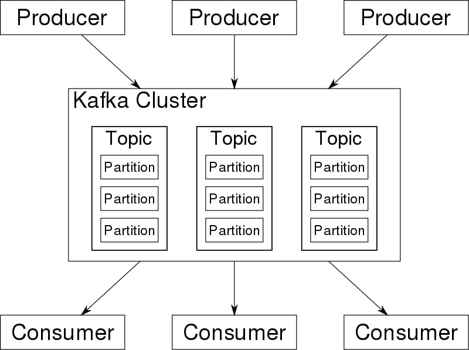
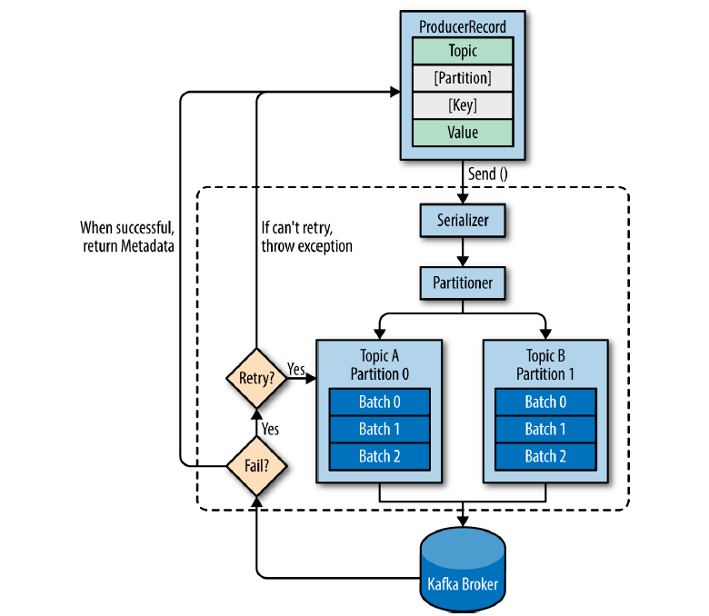

# Kafka - subscriber and publisher

Apache Kafka is a framework implementation of a software bus using stream-processing. It is an open-source software platform developed by the Apache Software Foundation written in Scala and Java. The project aims to provide a unified, high-throughput, low-latency platform for handling real-time data feeds.  
<https://en.wikipedia.org/wiki/Apache_Kafka>

[Reference link](https://en.wikipedia.org/wiki/Apache_Kafka)

[Reference link](https://stackoverflow.com/questions/38024514/understanding-kafka-topics-and-partitions)

Apache Kafka is an open-source distributed event streaming platform used by thousands of companies for high-performance data pipelines, streaming analytics, data integration, and mission-critical applications.  
<https://kafka.apache.org/>

## Technology
- Kafka
- Confluent Platform for Apache Kafka
- Maven
- Kotlin
- AWS Corretto 11
- Apache Avro
    - schema-based data serialization library

## Getting started
1. Download the Git repository
2. Install dependencies: `mvn clean install -U`
3. Run Kafka and Zookeeper - see [KAFKA-SETUP.md](./KAFKA-SETUP.md)
4. After establishing services, run a producer and a consumer from corresponding project's modules:
   - `kafka-producer`
   - `kafka-consumer`
5. Follow console output and check the behaviour.

## Useful links
- https://kotlinlang.org/docs/maven.html
- https://github.com/only2dhir/kafkaexample
- https://github.com/perkss/kotlin-kafka-and-kafka-streams-examples
- https://www.confluent.io/resources/kafka-the-definitive-guide/
