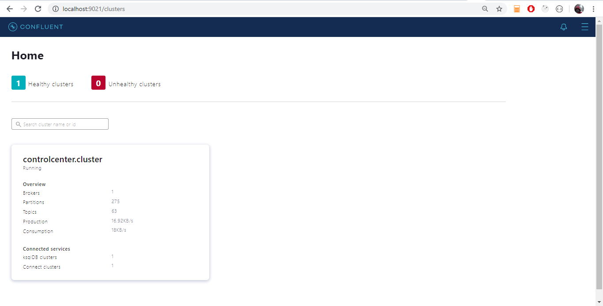

# Kafka - Producer and Consumer

Apache Kafka is a framework implementation of a software bus using stream-processing. It is an open-source software platform developed by the Apache Software Foundation written in Scala and Java. The project aims to provide a unified, high-throughput, low-latency platform for handling real-time data feeds.  
<https://en.wikipedia.org/wiki/Apache_Kafka>

Apache Kafka is an open-source distributed event streaming platform used by thousands of companies for high-performance data pipelines, streaming analytics, data integration, and mission-critical applications.  
<https://kafka.apache.org/>

[Reference link](https://en.wikipedia.org/wiki/Apache_Kafka)

[Reference link](https://stackoverflow.com/questions/38024514/understanding-kafka-topics-and-partitions)
- Record: Producer sends messages to Kafka in the form of records. A record is a key-value pair. It contains the topic name and partition number to be sent. Kafka broker keeps records inside topic partitions. Records sequence is maintained at the partition level. You can define the logic on which basis partition will be determined.
- Topic: Producer writes a record on a topic and the consumer listens to it. A topic can have many partitions but must have at least one.
- Partition: A topic partition is a unit of parallelism in Kafka, i.e. two consumers cannot consume messages from the same partition at the same time. A consumer can consume from multiple partitions at the same time.
- Offset: A record in a partition has an offset associated with it. Think of it like this: partition is like an array; offsets are like indexs.
- Producer: Creates a record and publishes it to the broker.
- Consumer: Consumes records from the broker.

If you are looking for a book about Kafka, let's have a look on ``Kafka: The Definitive Guide`` which you can get here: <https://www.confluent.io/resources/kafka-the-definitive-guide/>

## Technology
- Kafka
- Confluent Platform for Apache Kafka (6.1.1)
- Maven
- Kotlin 1.4.30
- Java
- AWS Corretto 11
- Apache Avro
    - schema-based data serialization library
- Avro Kotlin
    - https://github.com/avro-kotlin/avro4k
    - Limitations: cannot generate a class from .avsc file (it allows on generating a schema based on a Kotlin class).

## Getting started
1. Download the Git repository
2. Install dependencies: `mvn clean install -U`
3. If your IDE doesn't see generated Avro classes, mark `target/generated-source` as `generated sources`.
   
3. Run Kafka and Zookeeper - see [KAFKA-SETUP.md](./KAFKA-SETUP.md)
4. After establishing services, run a producer, run a consumer from corresponding project's modules:
    - `**-kafka-producer`
    - `**-kafka-consumer`
    - You can also run all at once using `starter` modules for Kotlin/Java.
5. Follow console output and check the behaviour.
6. Open the Confluent Platform dashboard: `http://localhost:9021/`
    

## SSL/TLS Kafka configuration
Generate certificates using Confluent script -  [instruction](ssl-tls-example/README-SSL-TLS.md).

Complete TLS/SSL Kafka configuration - [instruction](./secrets/README-SECRETS.md)

## Message Queue vs Streaming (Kafka)

A message queue, sometimes called a point-to-point communication, is fairly straightforward. A message queue can have one or more consumers and/or producers. In a message queue with multiple consumers, the queue will attempt to distribute the messages evenly across them, with the guarantee being that every message will only be delivered once.

A streaming broker is different from a message queue for many reasons. For starters, messages are organized into log files or topics. One or more consumers can subscribe to a log file or topic to receive all messages that come through that stream. With proper setup, a streaming broker will deliver the same message to every subscriber, in a specific order. This is often described as a publish-subscribe pattern.

While many consumers may be active, queues only deliver messages to a single consumer (typically whichever consumer is available to receive it first) before removing that message from the queue. Meanwhile, streaming brokers send the same message to every subscriber of that log file.

In a queue, once a message is delivered, it's gone forever. To reprocess a message, you have to have a backup, like a batch layer, so that you can put it back into the queue. In comparison, a streaming broker uses a distributed log file, so consumers can move backward and forward within that file to re-process messages they've already received on command.

https://blog.iron.io/message-queue-vs-streaming/

## Useful commands
- mvn clean install -U -DskipTests

## Useful links
- https://kotlinlang.org/docs/maven.html
- https://github.com/only2dhir/kafkaexample
- https://dzone.com/articles/kafka-producer-and-consumer-example
