# Kafka - Producer and Consumer

- [Technology](#technology)
- [Getting started](#getting-started)
  - [Run Kafka locally](#run-kafka-locally)
  - [SSL/TLS Kafka configuration](#ssltls-kafka-configuration)
  - [Docker and Docker Compose commands](#docker-and-docker-compose-commands)
- [Kafka introduction](#kafka-introduction)
- [Confluent Platform](#confluent-platform)
- [Message Queue vs Streaming (Kafka)](#message-queue-vs-streaming-kafka)
- [Reprocess failed messages](#reprocess-failed-messages)
- [Event-driven architecture](#event-driven-architecture)
- [Fault tolerance, high availability and Resiliency](#fault-tolerance-high-availability-and-resiliency)
- [What happens when a new consumer joins the group in Kafka? (rebalancing)](#what-happens-when-a-new-consumer-joins-the-group-in-kafka-rebalancing)
- [To consideration](#to-consideration)
- [Kafka best practises](#kafka-best-practises)
- [5 Common Pitfalls When Using Apache Kafka](#5-common-pitfalls-when-using-apache-kafka)
- [Production failure scenarios](#production-failure-scenarios)
- [Useful links](#useful-links)

---

| Branch |                                                                                               Pipeline                                                                                               |                                                                                            Code coverage                                                                                             |                                          Test report                                           |                                 SonarCloud                                 |
|:------:|:----------------------------------------------------------------------------------------------------------------------------------------------------------------------------------------------------:|:----------------------------------------------------------------------------------------------------------------------------------------------------------------------------------------------------:|:----------------------------------------------------------------------------------------------:|:--------------------------------------------------------------------------:|
| master | [](https://gitlab.com/ShowMeYourCodeYouTube/kafka-producer-consumer/-/commits/master) | [](https://gitlab.com/ShowMeYourCodeYouTube/kafka-producer-consumer/-/commits/master) | [link](https://showmeyourcodeyoutube.gitlab.io/kafka-producer-consumer/test-report/index.html) | [link](https://sonarcloud.io/organizations/showmeyourcodeyoutube/projects) |


## Technology

- Kafka / Kafka Streams
- Confluent Platform for Apache Kafka
- Maven
- Kotlin
- Java
- AWS Corretto
- Spring Boot 3.x (module `java-spring`) and standalone Kafka libraries (modules `kotlin` and `java`)
- Apache Avro
    - schema-based data serialization library
- Avro Kotlin
    - https://github.com/avro-kotlin/avro4k
    - Limitations: cannot generate a class from .avsc file (it allows on generating a schema based on a Kotlin class).
- Junit/Mockito/AssertJ + EmbeddedKafka

## Getting started

1. Download the Git repository
2. Enable annotation processing in your IDE (required by Lombok).
3. Install dependencies: `mvn clean install -U`
4. If your IDE doesn't see generated Avro classes, mark `java/java-kafka-producer/target/generated-sources` as `Generated Sources Root`.  
   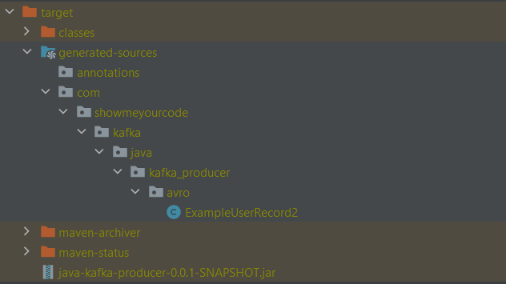  
5. Run Kafka and Zookeeper - see [Run Kafka locally](#run-kafka-locally)
6. When services are up, run a producer/consumer from any of modules:
   1. Standalone Kafka libraries:
       - `java|kotlin/**-kafka-producer`
       - `java|kotlin/**-kafka-consumer`
       - You can also run all at once using `java|kotlin/**-starter` modules for Java/Kotlin.
   2. Spring Boot application:
      - `spring/java-spring`
      - You can run the module many times and change the default port.
7. Follow console output and check the behaviour.
8. Open the Confluent Platform dashboard: `http://localhost:9021/`  
    

### Run Kafka locally

Run Kafka and Zookeeper using Docker Compose.
- `docker-compose up -d --remove-orphans`
  - The default file taken by the command is `docker-compose.yml`

### Docker and Docker Compose commands

If you don't use IDE plugins, here you can find useful Docker commands:
- Show all containers
  - `docker container list`
- Stop a Docker container
  - `docker container stop [container_id]`
- Remove a Docker container
  - `docker container rm [container_id]`
- Build Docker Compose with the default file docker-compose.yml and remove previous containers
  - `docker-compose up -d --remove-orphans`
- Show Docker Compose containers
  - `docker-compose ps`
- Stop all running containers
  - `docker stop $(docker ps -a -q)`
- Delete all stopped containers
  - `docker rm $(docker ps -a -q)`

Reference: <https://www.codenotary.com/blog/extremely-useful-docker-commands/>

### SSL/TLS Kafka configuration

Generate certificates using Confluent script -  [instruction](ssl-tls-example/README-SSL-TLS.md).

Complete TLS/SSL Kafka configuration - [instruction](./secrets/README-SECRETS.md)

## Kafka introduction

Apache Kafka is a distributed event store and stream-processing platform. It is an open-source software platform developed by the Apache Software Foundation written in Scala and Java. The project aims to provide a unified, high-throughput, low-latency platform for handling real-time data feeds.  

<https://en.wikipedia.org/wiki/Apache_Kafka>  
<https://kafka.apache.org/>

**How does Kafka work?**

- Kafka records are stored sequentially in the logs. A Kafka record contains:
  - Key (Optional)
    - Used for partitioning & message ordering
  - Value
    - The actual message content (JSON, Avro, etc.)
  - Timestamp
    - The time Kafka received the message
  - Offset
    - A unique ID for ordering in the partition
  - Headers (Optional)
- Kafka combines two messaging models, queuing and publish-subscribe, to provide the key benefits of each to consumers. 
  - Queuing allows for data processing to be distributed across many consumer instances, making it highly scalable. However, traditional queues aren't multi-subscriber.
  - The publish-subscribe approach is multi-subscriber, but because every message goes to every subscriber it cannot be used to distribute work across multiple worker processes.
  - Kafka uses a partitioned log model to stitch together these two solutions. A log is an ordered sequence of records, and these logs are broken up into segments, or partitions, that correspond to different subscribers. This means that there can be multiple subscribers to the same topic and each is assigned a partition to allow for higher scalability.
  - Finally, Kafka’s model provides replayability, which allows multiple independent applications reading from data streams to work independently at their own rate. This is possible because Kafka retains messages for a configurable amount of time (or indefinitely) instead of deleting them immediately after consumption.
- Kafka’s topics are divided into several partitions. While the topic is a logical concept in Kafka, a partition is the smallest storage unit that holds a subset of records owned by a topic. Each partition is a single log file where records are written to it in an append-only fashion.
- References
  - <https://kafka.apache.org/documentation/#log>
  - <https://stackoverflow.com/questions/54124844/how-the-kafka-topic-offsets-works>
  - <https://aws.amazon.com/msk/what-is-kafka/>

Example:

Kafka Producer-Consumer with Consumer Groups (Queue Model)
1. Producer (Message Sender)
   - Publishes messages to a Kafka topic (e.g., orders).
   - Messages are distributed across partitions based on the key (if provided).
   - Uses acks=all to ensure durability. 
     - acks=0:
       - No acknowledgment is required from the broker. 
       - The producer does not wait for any confirmation. 
       - Risk: There’s a chance of data loss if the message is lost before being written to the broker. 
     - acks=1:
       - At least one broker (the leader of the partition) must acknowledge the message. 
       - The producer waits for the leader's acknowledgment but does not wait for followers. 
       - Risk: If the leader crashes immediately after acknowledging but before the message is replicated to followers, data loss can occur. 
     - acks=all (or acks=-1):
       - All in-sync replicas (ISR) must acknowledge the message before the producer receives an acknowledgment. 
       - The producer waits for confirmation from all replicas that the message has been successfully written. 
       - Guarantees: This is the most reliable setting because it ensures the message is written to all replicas. If any replica is out of sync or unavailable, the producer will not get an acknowledgment, reducing the chances of data loss.
2. Topic Configuration (Queue Model)
   - The topic orders has multiple partitions (e.g., 3).
   - Messages are not broadcast to all consumers; instead, they are load-balanced across consumers in the same group.
   - Messages remain in Kafka until log retention expires or storage limits are hit.
3. Consumer Group (Message Receivers)
   - Multiple consumers subscribe to the same topic under the same group ID (e.g., "order-processing").
   - Kafka automatically assigns partitions to consumers.
   - If one consumer goes down, its partition is reassigned to another consumer in the group.
   - Consumers in different groups can read the same messages independently.
4. Consumer Behavior
   - Each consumer in a group processes a subset of partitions.
   - No two consumers in the same group receive the same message.
   - If a new consumer joins, Kafka rebalances partitions across the group.
5. Example Scenario
   - A producer sends 10 messages to orders (3 partitions).
   - A consumer group with 3 consumers (C1, C2, C3) consumes messages.
   - Kafka distributes messages:
     - Partition 0 → C1
     - Partition 1 → C2
     - Partition 2 → C3
     - If C2 stops, its partition is reassigned to C1 or C3.


If a consumer is not part of a consumer group in Kafka, it behaves like an independent standalone consumer and does not participate in load balancing. Here's how this affects the message consumption:
- Messages are not shared: If the consumer is not part of a consumer group, it will get all messages from the topic, even if multiple consumers are consuming from the same topic. This is different from the behavior in a consumer group, where each message is consumed by only one consumer in the group.
- Independent consumption: This means that a non-grouped consumer will read the same message multiple times, as Kafka does not coordinate message distribution between independent consumers.
- Subscription: The consumer will subscribe to a topic or partition, and Kafka will send all messages in that topic (or partition) to the consumer, regardless of whether other consumers are also reading from the same topic.

---

In order to understand Kafka, let's explain **basic terminology**:

- Record: Producer sends messages to Kafka in the form of records. A record is a key-value pair. It contains the topic name to be sent and other attributes which are optional e.g. partition number or key. Kafka broker keeps records inside topic partitions. Records sequence is maintained at the partition level. You can define the logic on which basis partition will be determined.
  - Kafka records are in a key/value format, where the keys can be null.
  - If no partition/key is specified, Kafka will use a round-robin partition assignment.
  - If the ordering of the messages matters for you, then the key is important. Let’s say you have a Kafka topic where you want to send order status. If you receive several status updates about the same order - like “prepared”, “shipped”, and “delivered”, you want to make sure that the applications consumes these statutes in the right order. 
  - Kafka can guarantee ordering only inside the same partition, and it is therefore important to be able to route correlated messages into the same partition. To do so you need to specify a key for each message and Kafka will put all messages with the same key in the same partition.
  - Another example, if you have cars and you want to get all the GPS positions in order for that particular car then you need to make sure to have your message key set as the unique identifier for your care order id as the message key makes perfect sense.
  - References
    - https://forum.confluent.io/t/what-should-i-use-as-the-key-for-my-kafka-message/312
    - https://www.geeksforgeeks.org/apache-kafka-message-keys/
    - https://silverback-messaging.net/concepts/broker/kafka/kafka-partitioning.html
    - [Understanding Kafka Topic Partitions](https://medium.com/event-driven-utopia/understanding-kafka-topic-partitions-ae40f80552e8)
- Topic: Producer writes a record on a topic and the consumer listens to it. A topic can have many partitions but must have at least one.
- Partition: A topic partition is a unit of parallelism in Kafka, i.e. two consumers cannot consume messages from the same partition at the same time. A consumer can consume from multiple partitions at the same time.
  - A single message sent to a particular topic will be routed to one of partitions. Remember the message is not replicated to all partitions. The message can ba replicated only across brokers contains the same topic (see a diagram below).
  - Kafka can replicate partitions across a configurable number of Kafka servers which is used for fault tolerance. Each partition has a leader server and zero or more follower servers. Leaders handle all read and write requests for a partition. Followers replicate leaders and take over if the leader dies. [Reference](https://cloudurable.com/blog/kafka-architecture-topics/index.html)
- Offset: A record in a partition has an offset associated with it. Think of it like this: partition is like an array; offsets are like indexes.
- Producer: Creates a record and publishes it to the broker.
- Consumer: Consumes records from the broker.
  - Messages are not removed once a consumer acknowledge the message. Purging of messages in Kafka is done automatically by either specifying a retention time for a topic or by defining a disk quota for it so for your case of one 5GB file, this file will be deleted after the retention period you define has passed, regardless of if it has been consumed or not. [Reference 1](https://gist.github.com/slgithub/28e388ae361d357c9dcf) / [Reference 2](https://stackoverflow.com/questions/28586008/delete-message-after-consuming-it-in-kafka)
  - Consumers can:
    - Specify Topic(s) to read data - Subscribe/Assign
    - Read data (sequentially)  - Poll
    - Optional reposition - Seek
    - Save position (ack processed) - Commit

If you are looking for a book about Kafka, let's have a look on ``Kafka: The Definitive Guide`` which you can get here: <https://www.confluent.io/resources/kafka-the-definitive-guide/>

---

Below there are many design/conceptual diagrams showing how Kafka works.

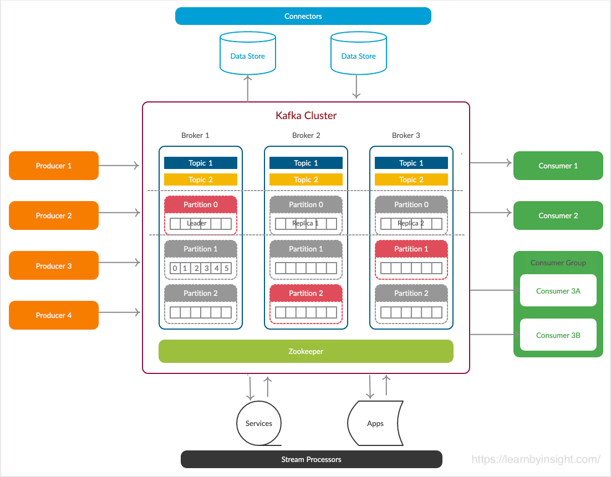

[Reference link](https://hevodata.com/learn/kafka-clusters/)

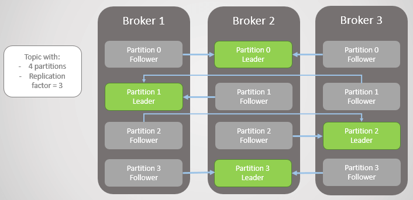

[Reference link](https://jack-vanlightly.com/blog/2018/9/2/rabbitmq-vs-kafka-part-6-fault-tolerance-and-high-availability-with-kafka)

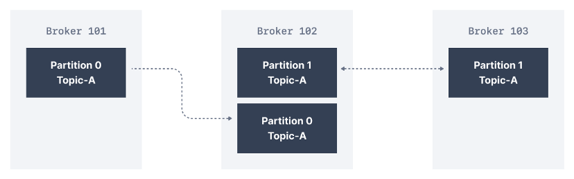

Kafka Replication Factor refers to the multiple copies of data stored across several Kafka brokers. In the above diagram consisting of three brokers, the replication factor is 2.  
[Reference link](https://blog.clairvoyantsoft.com/steps-to-increase-the-replication-factor-of-a-kafka-topic-a516aefd7e7e)

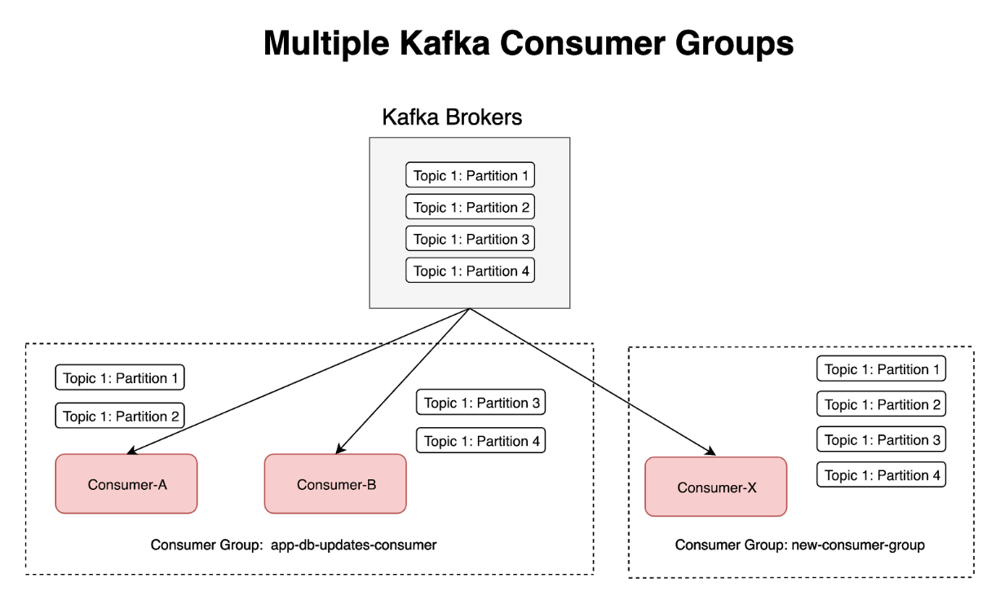

[Reference link](https://medium.com/@jhansireddy007/how-to-parallelise-kafka-consumers-59c8b0bbc37a)


[Reference link](https://stackoverflow.com/questions/38024514/understanding-kafka-topics-and-partitions)

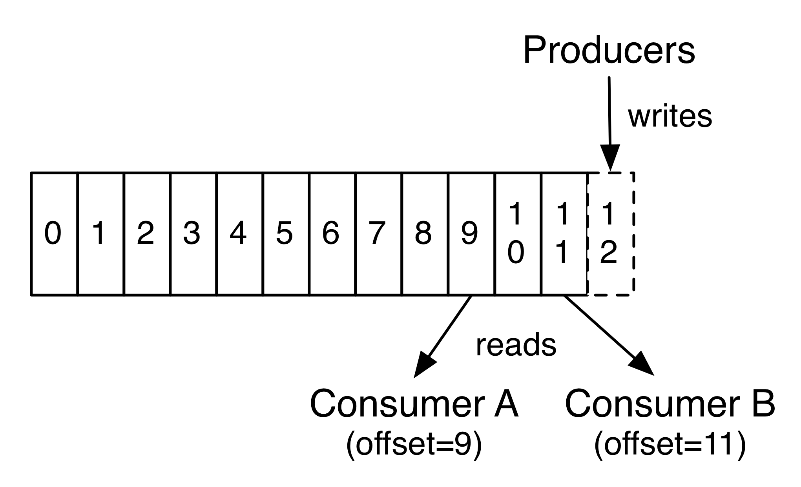

[Reference link](https://kafka.apache.org/documentation/#intro_topics)

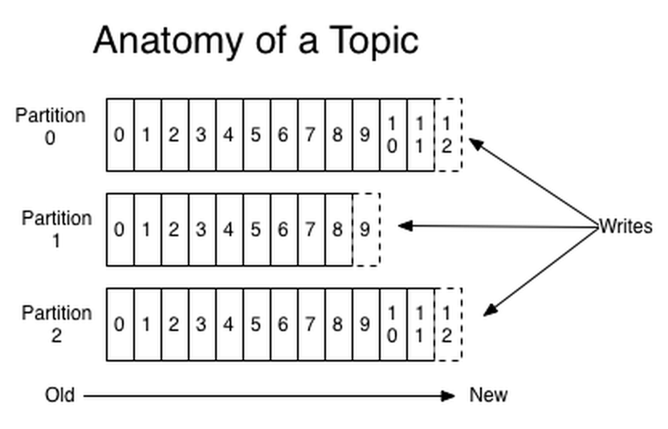

[Reference link](https://kafka.apache.org/081/documentation.html)

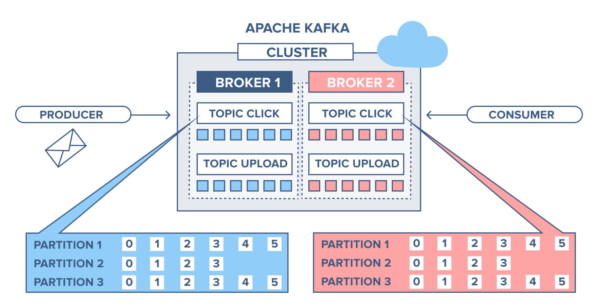

[Reference link](https://www.cloudkarafka.com/blog/part1-kafka-for-beginners-what-is-apache-kafka.html)

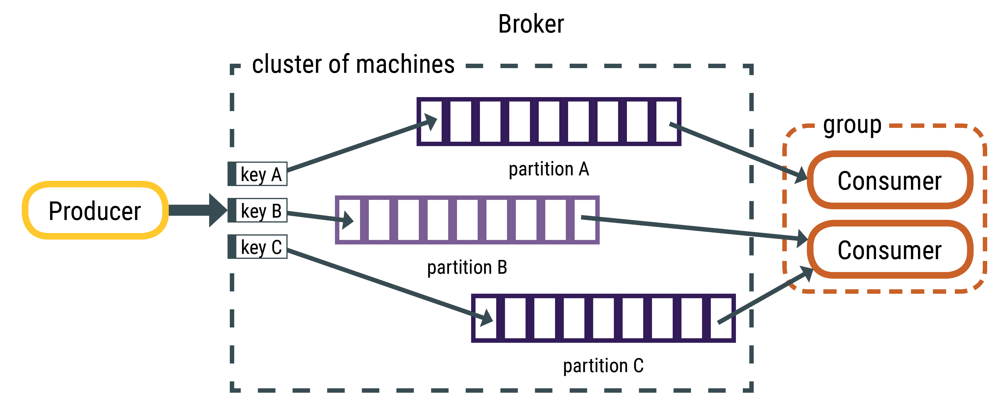  

[Reference link](https://docs.datastax.com/en/kafka/doc/kafka/kafkaHowMessages.html)

## Confluent Platform

The Confluent setup provides web UI for the whole Kafka platform.  
More information you can find in this guideline: <https://docs.confluent.io/platform/current/quickstart/ce-docker-quickstart.html>

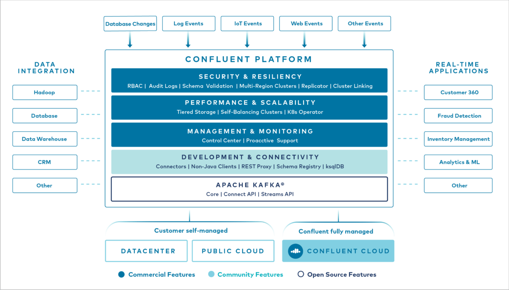

[Reference link](https://docs.confluent.io/platform/current/platform.html)

- **Confluent Control Center** is a web-based tool for managing and monitoring Apache Kafka®. Control Center provides a user interface that allows developers and operators to get a quick overview of cluster health, observe and control messages, topics, and Schema Registry, and to develop and run ksqlDB queries. See more: <https://docs.confluent.io/platform/current/control-center/index.html>

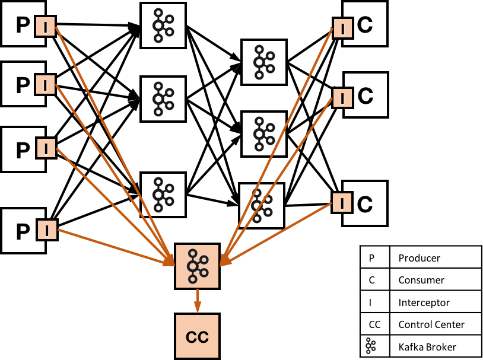

- **Confluent Schema Registry** provides a serving layer for your metadata. It provides a RESTful interface for storing and retrieving your Avro®, JSON Schema, and Protobuf schemas. See more: <https://docs.confluent.io/platform/current/schema-registry/index.html>
- **ksqlDB** is the streaming SQL engine for Kafka. It provides an easy-to-use yet powerful interactive SQL interface for stream processing on Kafka, without the need to write code in a programming language such as Java or Python.

## Message Queue vs Streaming (Kafka)

`A message queue`, sometimes called a point-to-point communication, is fairly straightforward. A message queue can have one or more consumers and/or producers. In a message queue with multiple consumers, the queue will attempt to distribute the messages evenly across them, with the guarantee being that every message will only be delivered once.

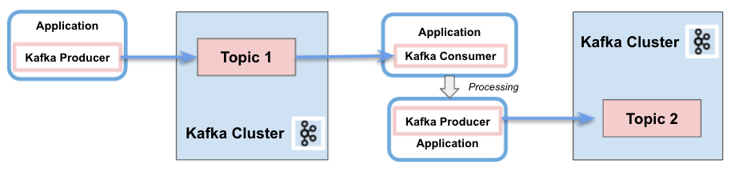

`A streaming broker` is different from a message queue for many reasons. For starters, messages are organized into log files or topics. One or more consumers can subscribe to a log file or topic to receive all messages that come through that stream. With proper setup, a streaming broker will deliver the same message to every subscriber, in a specific order. This is often described as a publish-subscribe pattern.

While many consumers may be active, queues only deliver messages to a single consumer (typically whichever consumer is available to receive it first) before removing that message from the queue. Meanwhile, streaming brokers send the same message to every subscriber of that log file.

In a queue, once a message is delivered, it's gone forever. To reprocess a message, you have to have a backup, like a batch layer, so that you can put it back into the queue. In comparison, a streaming broker uses a distributed log file, so consumers can move backward and forward within that file to re-process messages they've already received on command.

---

Kafka Streams is a client library for building real-time stream processing applications on top of Kafka topics. It allows for complex event processing, stateful transformations, and aggregations of data in motion. Kafka Streams operates on Kafka topics and provides a rich API for stream processing.

Key Features:
- Real-Time Stream Processing: Kafka Streams is designed to process data in real time. It allows you to consume, transform, and produce streams of data with low latency.
- Stateful Processing: Kafka Streams supports stateful operations like windowing, aggregations, joins, and keeping track of state between messages (using local state stores).
- Fault Tolerance: Kafka Streams provides fault tolerance by replicating the state to Kafka topics, ensuring that the state can be recovered if a stream processing instance fails.
- Exactly Once Semantics (EOS): Kafka Streams ensures that messages are processed exactly once across failures, which guarantees no duplication or message loss during processing.
- Distributed and Scalable: Kafka Streams applications are inherently distributed and scalable. You can add more processing nodes to handle higher loads.
- Stream-Processing APIs: Kafka Streams provides APIs for common stream-processing tasks like:
filter(), map(), flatMap(), groupBy(), reduce(), join(), and windowing.

Kafka Streams Use Cases:
- Real-time analytics: Aggregating logs, metrics, or data streams in real-time.
- Event-driven applications: Processing events from Kafka topics in real-time (e.g., order processing, fraud detection).
- ETL pipelines: Kafka Streams can perform transformations (ETL-like operations) on the data as it moves through Kafka topics.
- Stateful operations: Applications that require maintaining state over time (e.g., counting occurrences of events, aggregating user data).


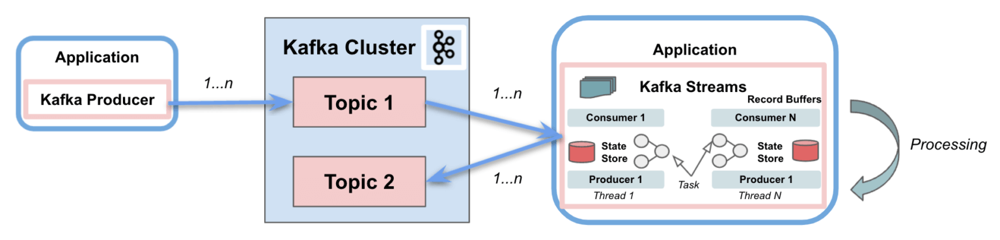

- https://blog.iron.io/message-queue-vs-streaming/
- https://www.baeldung.com/java-kafka-streams-vs-kafka-consumer


## Reprocess failed messages

```
We are implementing a Kafka Consumer using Spring Kafka. 
As I understand correctly if processing of a single message fails, there is an option to :
- Don't care and just ACK
- Do some retry handling using different business logic
- If even this doesn't work do some custom failure handling to send a message t DLQ
```
Reference: https://stackoverflow.com/questions/45883794/kafka-consumes-unprocessable-messages-how-to-reprocess-broken-messages-later

- One example is Spring Cloud Stream, which can be configured to publish failed messages to another topic errors.foo; users can then copy them back to the original topic to try again later. This logic is done in the recovery callback.  It's called a "Dead letter queue".
- By using the error handling deserialiser, you can capture the failed message and route it to a dead letter topic for later recovery. This allows you to have access to the failed message and take appropriate actions to fix and reprocess it. [Reference](https://oso.sh/blog/reprocess-messages-in-kafka/)
- If any uncaught exception happens during *Kafka Streams processing*, your stream will change status to ERROR and stop consuming incoming messages for partition on which error occurred. You need to catch exceptions by yourself. Retries could be achieved either: 
  - using Spring RetryTemplate to invoke external microservice (but keep in mind that you will have delays of consuming messages from a specific partition),
  - push failed message into another topic for later reprocessing (as you suggested)
- You can implement some kind of kafkaProducer that will be a messageFailureHandler and with it you can send all the failed messages to a dedicated kafka topic. If you are familiar with the concept of dead-letter-queue in kafka-connect, it kind of the same (besides in kafka-connect it's only a matter of configuration). [Reference](https://stackoverflow.com/questions/62586094/handling-failed-messages-using-kafka-streams-processor-api)

---

In short:
- Set the maximum retries: Implement a retry mechanism where failed messages are retried X number of times.
- Backoff strategy: Introduce a backoff period between retries to avoid overwhelming the consumer with retries.
- Move to DLQ after max retries: After X number of retries, move the message to the DLQ if it still can't be processed.

## Event-driven architecture

```text
Event-driven architecture is a software architecture and model for application design. 
With an event-driven system, the capture, communication, processing, and persistence of events are the core structure of the solution. 
This differs from a traditional request-driven model.
```

Event-driven architecture (EDA) is made up of event producers and event consumers. 
An event producer detects or senses an event and represents the event as a message. 
It does not know the consumer of the event, or the outcome of an event.

- An EDA is loosely coupled or entirely decoupled.
- An EDA uses asynchronous messaging, typically pub/sub.
- An EDA enables parallelism and fault tolerance, ensuring the system remains responsive and resilient
  - Fault tolerance refers to the ability of a system (computer, network, cloud cluster, etc.) to continue operating without interruption when one or more of its components fail.
  - Resilience can be defined as the capability to recover when stressed by load (more requests for service), attacks (either accidental through a bug, or deliberate through intention), and failure of any component in the workload’s components.
- An EDA provides an ability to build processing pipeline.
  - Data pipelines are data processing steps where raw data is ingested from various data sources and then ported to data store, like a data lake or data warehouse, for analysis
- An EDA thanks to availability of sophisticated event brokers reduce code complexity.
- An EDA provides proven [Enterprise Integration Patterns](https://www.enterpriseintegrationpatterns.com/).

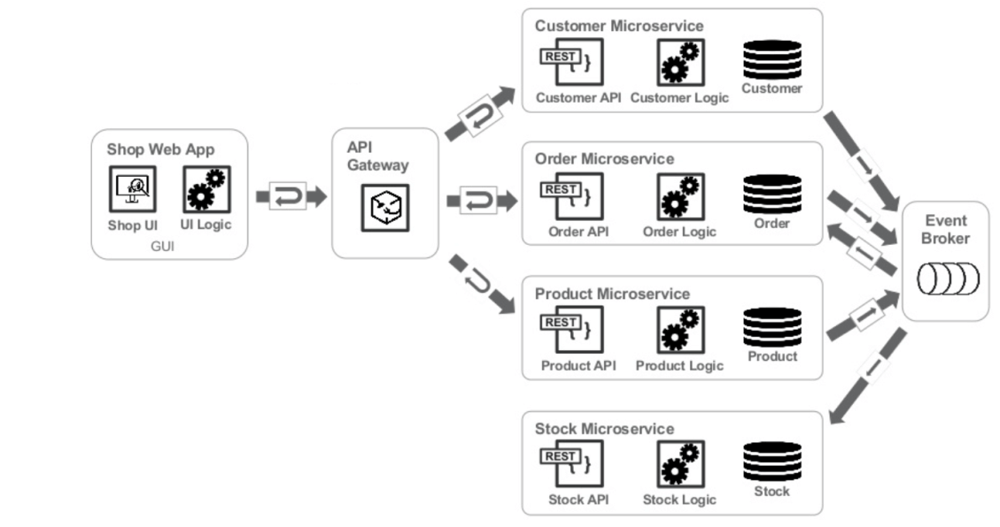

What is a message broker? What is the purpose? What are message broker models?
- A message broker is software that facilitates the exchange of messages between applications, systems, and services. It allows linked systems to communicate directly, even if they’re built using different technologies, deployed on separate platforms, or use distinct messaging protocols.
- For example, a web application might send messages to a mobile application, or a mobile application to a web application. In these cases, a message broker serves as a pipeline for different platforms to communicate. In short, message brokers help integrate applications and automate message transmission.
- Message brokers are included in messaging middleware or message-oriented middleware (MOM) systems. This form of middleware gives developers a consistent approach to handling data flow among an application's components and focus on its core functionality. Message brokering is commonly performed using middleware technologies such as Apache Kafka, RabbitMQ, Apache ActiveMQ, SimpleQueueService (SQS/AWS), and ZeroMQ.
- Message models
  - Point-to-Point messaging model
    - The Point-to-Point (P2P) pattern helps message queues where producers and consumers have a one-to-one relationship. Each message in the queue is forwarded to and consumed by a single consumer. P2P messaging is useful when a message needs to be acted upon only once.
    - Examples: AWS Simple Queue Service (SQS)
  - Publish/Subscribe messaging model
    - Publish/Subscribe messaging, also known as the pub/sub model, allows a producer to send messages to a topic. In this approach, the producer is known as a publisher, while the consumer is referred to as a subscriber. Different publishers can write on the same topic, and different subscribers can receive messages from one or more publishers.
  - Examples: AWS Simple Notification Service (SNS), Apache Kafka

References:
- https://stackoverflow.com/questions/72299824/event-driven-architecture-backend-services-with-two-interfaces-interface-type/
- https://developer.ibm.com/articles/eda-and-microservices-architecture-best-practices/
- https://databand.ai/blog/7-data-pipeline-examples-etl-data-science-ecommerce-and-more/
- https://www.g2.com/articles/message-broker

### Event-driven architecture models

An event driven architecture may be based on either a pub/sub model or an event stream model. 

- `Pub/sub model`
  - This is a messaging infrastructure based on subscriptions to an event stream. With this model, after an event occurs, or is published, it is sent to subscribers that need to be informed.
- `Event streaming model`
  - With an event streaming model, events are written to a log. Event consumers don’t subscribe to an event stream. Instead, they can read from any part of the stream and can join the stream at any time.

```text
Message Queues: MQs are a point-to-point communication system where messages are sent to a single receiver, ensuring ordered and reliable delivery.
Publish-Subscribe: In Pub/Sub systems, messages are sent to multiple subscribers simultaneously, promoting decoupling and scalability.
```
```text
What's the difference between a message broker an API communication?
Message broker provides asynchronous communication.
API is synchronous.
```

Reference: <https://www.g2.com/articles/message-broker>

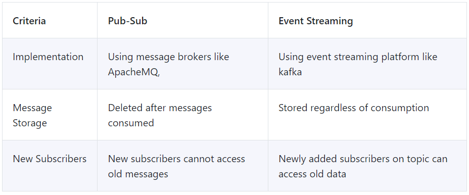

Ref: <https://metamug.com/article/distributed-systems/event-streaming-pub-sub.html/>

References:
- https://cloud.google.com/solutions/event-driven-architecture-pubsub/
- https://blog.iron.io/message-queue-vs-publish-subscribe/
- https://blog.ippon.tech/event-driven-architecture-getting-started-with-kafka-part-1/
- https://hevodata.com/learn/kafka-event-driven-architecture/
- https://www.redhat.com/en/topics/integration/what-is-event-driven-architecture
- https://learn.microsoft.com/en-us/azure/architecture/guide/architecture-styles/event-driven
- (recommended) **https://microservices.io/patterns/data/event-driven-architecture.html**

## Fault tolerance, high availability and resiliency

```text
Fault tolerance is the property that enables a system to continue
operating properly in the event of the failure of one or more faults
within some of its components.
```

```text
IT resilience is the ability of an organization to maintain 
acceptable service levels when there is a disruption of business operations, 
critical processes, or your IT ecosystem.
```

```text
High availability (HA) is the ability of a system to operate continuously without failing for a designated period of time. 
```

- Kafka is sending ACK when a message is completely replicated to all brokers accordingly to settings. The min. insync. Replicas is a config on the broker that denotes the minimum number of in-sync replicas required to exist for a broker to allow acks=all requests. If not enough brokers are available, a message cannot be accepted by Kafka.
- The message will be in a buffer for limited time. If it's not published during this time, TimeoutException is thrown.
- An in-sync replica (ISR) is a broker that has the latest data for a given partition. A leader is always an in-sync replica.

```text
void sendSync() throws InterruptedException {
    try {
        Future<RecordMetadata> send = kafkaProducer.send(record);
        log.info("Record metadata: {}",send.get().toString());
    } catch(Exception e){
        if (e.getCause() instanceof TopicAuthorizationException){
            log.error("Not allowed to publish to topic!");
            throw new RuntimeException(e);
        }
        if (e.getCause() instanceof TimeoutException){
            log.error("TimeoutException: "+ e.getMessage());
            if (retries > MAX_RETRIES){
                backoffTime = MAX_TIME;
                log.info("Timeout has been increased to {}", MAX_TIME);
            } else {
                  retries++;
                  log.info("Retries currently at {}", retires);
            }
            Thread.sleep(backoffTime);
            sendSync(record);
        }
    }
}
```

Example error:
```text
(...) retrying (2147483630 attempts left). Error: NOT_ENOUGH_REPLICAS
```

References:
- https://www.datacore.com/blog/availability-durability-reliability-resilience-fault-tolerance/
- https://www.macrometa.com/distributed-data/high-availability-vs-fault-tolerance

## What happens when a new consumer joins the group in Kafka? (rebalancing)

What is a rebalancing? All messages on a topic are spread out among the members of consumer group. Every consumer has its set of partitions assigned exclusively to it and rebalancing is all about maintaining all partitions assigned to active consumers.

When one consumer dies Kafka needs to reassign orphaned partitions to the rest of the consumers. Similarly, when a new consumer joins the group Kafka needs to free up some partitions and assign them to the new consumers (if it can).

Rebalancing is the process where a group of consumer instances (belonging to the same group) co-ordinate to own a mutually exclusive set of partitions of topics that the group is subscribed to.

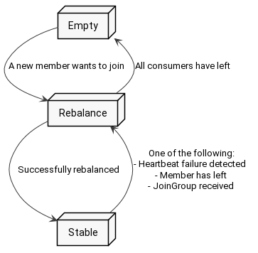  

Reference: https://chrzaszcz.dev/2019/06/kafka-rebalancing/

## To consideration

- Async and Sync usage and implications.
  - In Kafka, There is Three type of producers mainly grouped into Async and Sync. 
  - Sync Producer Acks = 0 (Fire and Forget)
    - In Fire and Forget Scenario we are not wait for any response and there is no any retries. So, There is no guarantee that message is delivered or not. So in this case there is
      - Possible loss of messages 
      - High throughput 
      - No Retries
  - Sync Producer Acks = 1 or Acks = all
    - In Sync producer with acks = 1, The producer will wait for the response from the leader of the partition. So there is a guarantee only from partition leader broker. But there is a message loss possibility if leader broker crashed and there is no In sync replicas for that. Throughput is lower than Async and Fire and Forget And retries are as producer retries configuration. 
    - In Sync producer with acks = all, The producer will wait for the response from the leader of the partition and the all In sync Replicas. So there is a guarantee from partition leader broker and In sync Replica brokers. We can make sure number of In sync replicas with Min In sync Replica configuration. Throughput is lowest And retries are as producer retries configuration. But highest reliable producer.
  - Async Producer
    - Async Producer almost same as Fire and Forget producer but there is some differences. It has a callback function to get if there is any response from the broker side. But producer is not waiting for that response, It is happening in the background. So difference is there is a trace if broker send some producer errors and there is retries. Because of Async retries, The order of the messages is not guarantee.
  - [Difference between Kafka async and Kafka sync acks=0?](https://stackoverflow.com/questions/67924473/difference-between-kafka-async-and-kafka-sync-acks-0)
- Sending batches vs single record.
  - An example of using a batch listener might be if you to want to send data from multiple records to a database in one SQL statement (which might be more efficient than sending them one-at-a-time). 
  - Another case is if you are using transactions; again, it might be more efficient to use one transaction for multiple SQL updates. 
  - Generally, it's a performance consideration; if that's not a concern then the simpler one-at-a-time processing might be more suitable.
  - On producer side:
    - By default, Kafka producer will accumulate records in a batch up to 16KB. By default, the producer will have up to 5 requests in flight, meaning that 5 batches can be sent to Kafka at the same time. Meanwhile, the producer start to accumulate data for the next batches. 
    - The acks config controls the number of brokers required to answer in order to consider each request successful. 
  - On consumer side:
    - By default, the Kafka consumer regularly calls poll() to get a maximum of 500 records per poll. 
    - Also by default, the Kafka consumer will ack every 5 seconds. Meaning that the consumer will commit all the records that have been polled during the last 5 seconds by all the subsequent calls to poll().
    - With a record-based listener, the records returned by the poll are handed to the listener one at a time. The container can be configured to commit the offsets one-at-a-time, or after all records are processed (default). 
    - With a batch listener, the records returned by the poll are all handed to the listener in one call.
    - It completely depends on what your listener is doing with the data. If it processes each record in a loop then there is no benefit; you might as well just let the container iterate over the collection and send the listener one record at-a-time. Batch mode will improve performance if you are processing the batch as a whole - e.g. a batch insert using JDBC in a single transaction. This will often run much faster than storing one record at-a-time (using a new transaction for each record) because it requires fewer round trips to the DB server.
  - References
    - https://stackoverflow.com/questions/64456501/when-should-i-use-batch-consumer-vs-single-record-consumer
    - https://stackoverflow.com/questions/74088393/difference-between-kafka-batch-and-kafka-request
    - https://stackoverflow.com/questions/64394333/whats-the-basic-difference-between-single-record-kafka-consumer-and-kafka-batch
    - https://stackoverflow.com/questions/67992900/springboot-batch-listener-mode-vs-non-batch-listener-mode
- How to ensure message order?
  - In Kafka, order can only be guaranteed within a partition. This means that if messages were sent from the producer in a specific order, the broker will write them to a partition and all consumers will read from that in the same order. So naturally, single-partition topic is easier to enforce ordering compared to its multiple-partition siblings. However, with a single partition, it is difficult to achieve parallelism and load balancing.
  - Hashing Key Partition
    - In this method we can create a ProducerRecord, specify a message key, by calling new ProducerRecord (topic name, message key, message). 
    - The default partitioner will use the hash of the key to ensure that all messages for the same key go to same producer. This is the easiest and most common approach.
  - Custom Partitioner
    - We can write our own business logic to decide which message need to be send to which partition. With this approach, we can make ordering of messages as per our business logic and achieve parallelism at the same time.
  - Reference: https://medium.com/latentview-data-services/how-to-use-apache-kafka-to-guarantee-message-ordering-ac2d00da6c22
- Closing the producer.
  - You should call Producer.flush() before calling Producer.close(). This is a blocking call and will return not before all record got sent. 
  - If you don't call close(), depending on the implementation/language you might end up with resource/memory leaks.
  - Reference: https://stackoverflow.com/questions/43057042/what-happens-if-i-dont-close-the-kafka-producer
- Important parameters and implications
  - Ordering
  - Timeout and what does that mean?
    - The configuration controls the maximum amount of time the client will wait for the response of a request. If the response is not received before the timeout elapses the client will resend the request if necessary or fail the request if retries are exhausted. [Confluent documentation](https://docs.confluent.io/platform/current/installation/configuration/consumer-configs.html#:~:text=request.timeout.ms,request%20if%20retries%20are%20exhausted.)
  - How/When to retry?
    - The ability for an application to retry is essential in order to recover from transient errors such as network connection failures rather than simply failing the processing. When a flow is triggered by the consumption of an event, then the consumer should be configured to retry on such retryable exceptions.
    - There are many situations where retrying an action that threw an exception may result in a success. Examples include:
      - A REST call to a third party service that returns a Bad Gateway (502) or a Service Unavailable (503) response, where the service may recover. 
      - An optimistic locking exception on a database write, where another process has updated the entity. 
      - A temporary database connection loss, or network connection error, both of which are considered transient errors. 
      - Internal Kafka exceptions like an offset not being available as it is lagging will also usually recover on retry.
    - To implement a retry logic for message processing in Kafka, we need to select an AckMode. This AckMode should allow the consumer to indicate to the broker which specific messages have been successfully processed. This way, the broker can redeliver any unacknowledged messages to another consumer.
    - Spring uses retryable topics to achieve non-blocking retry. Rather than retry an event from the original topic in a blocking manner, Spring Kafka instead writes the event to a separate retry topic. The event is marked as consumed from the original topic, so the next events continue to be polled and processed. Meanwhile a separate instance of the same consumer is instantiated by Spring as the consumer for the retry topic. This ensures that a single consumer instance is not polling and receiving events from both the original and a retry topic.
    - References
      - https://stackoverflow.com/questions/50073942/kafka-consumer-with-limited-number-of-retries-when-processing-messages?rq=4
      - https://www.lydtechconsulting.com/blog-kafka-spring-retry-topics.html
      - https://medium.com/lydtech-consulting/kafka-consumer-retry-646aa5aad2e4
      - https://stackoverflow.com/questions/55568856/how-can-i-retry-failure-messages-from-kafka
- Threading
  - The Kafka consumer is NOT thread-safe. All network I/O happens in the thread of the application making the call. It is the responsibility of the user to ensure that multi-threaded access is properly synchronized. Un-synchronized access will result in ConcurrentModificationException .
  - Multi-threaded access must be properly synchronized, which can be tricky.
  - Possible solutions
    - One topic Consumer Per Thread, avoiding multi-threaded access error.
    - One consumer with dynamic topic add, and multi-threaded access synchronized.
  - References
    - https://www.confluent.io/blog/kafka-consumer-multi-threaded-messaging/
    - https://stackoverflow.com/questions/53847066/getting-kafkaconsumer-is-not-safe-for-multi-threaded-access-error-when-i-use-cur
- Polling settings
  - Keep polling to maintain membership
  - max.poll.interval.ms (default 300s)
  - max.poll.records (default 500)
  - Server side configuration that prevents max.poll.interval.ms
  - "Backpressure can cause consumer to be kicked out"
- Consumer Rebalancing
  - Consumer with no heartbeat or not polling within the interval specified.
  - Group coordinator (Broker) not available.
  - Assignment strategy can be configured on client side.
- Offset and Commit
  - Commit can fail - especially if you don't own the partition any more.
    - This can happen when a group rebalance completes before the commit could be successfully applied. In this case, the commit cannot generally be retried because some of the partitions may have already been assigned to another member in the group.
  - Offset might not be continuous (example compact strategy is used for topic, or when producer uses transactions).
  - Commit expires after 2 weeks.
  - Default has enable.auto.commit=true
  - References
    - https://stackoverflow.com/questions/45220044/kafka-recover-from-commit-failed-exception
    - https://stackoverflow.com/questions/50135591/kafka-console-consumer-error-offset-commit-failed-on-partition
- Subscribe vs Assign
  - Subscribe makes use of the consumer group; Kafka coordinator sends assignment to a consumer and the partitions of the topics subscribed to, will be distributed to the instances within that group. Assign forces assignment to a list of topics.
  - Reference: https://stackoverflow.com/questions/53938125/kafkaconsumer-java-api-subscribe-vs-assign
- Important settings
  - ClientId
    - A client ID in Kafka is a label you define that names a particular consumer or producer. You can give your client a friendly name so that debugging is easier.
  - IsolationLevel e.g. read_uncommitted
    - Inside a transaction, a producer writes records to the Kafka topic partitions as it would normally do. If the transaction completes successfully, all the records previously written to the broker inside that transaction will be committed, and will be readable for consumers.
    - First, the isolation.level setting only has an impact on the consumer if the topics it's consuming from contains records written using a transactional producer. 
    - If so, if it's set to read_uncommitted, the consumer will simply read everything including aborted transactions. That is the default. 
    - When set to read_committed, the consumer will only be able to read records from committed transactions (in addition to records not part of transactions). It also means that in order to keep ordering, if a transaction is in-flight the consumer will not be able to consume records that are part of that transation. Basically the broker will only allow the consumer to read up to the Last Stable Offset (LSO). When the transation is committed (or aborted), the broker will update the LSO and the consumer will receive the new records. 
    - If you don't tolerate duplicates or records from aborted transactions, then you should use read_committed.
    - https://stackoverflow.com/questions/56047968/kafka-isolation-level-implications
  - GroupId
  - AutoOffsetResetConfig e.g. earliest
    - Kafka supports mainly three types of AutoOffsetReset values for the consumer application: 
      - Earliest — when the consumer application is initialized the first time or binds to a topic and wants to consume the historical messages present in a topic (consume from the beginning of the topic partition)
    - https://medium.com/lydtech-consulting/kafka-consumer-auto-offset-reset-d3962bad2665
  - EnableAutoCommitConfig
    - The setting `enable.auto.commit` means that offsets are committed automatically with a frequency controlled by the config auto.commit.interval.ms. The connection to the cluster is bootstrapped by specifying a list of one or more brokers to contact using the configuration bootstrap.
    - First, if you set `enable.auto.commit` (which is the default), then the consumer will automatically commit offsets periodically at the interval set by `auto.commit.interval.ms`.
  - MaxPollRecordConfig e.g. 10
  - MaxPollIntervalMsConfig e.g. 15000
  - PartitionAssignmentStrategyConfig e.g. RangeAssignor

## Kafka best practises

- Amazon Managed Streaming for Apache Kafka
  - https://docs.aws.amazon.com/msk/latest/developerguide/bestpractices.html
- Kafka Best Practices-Topic, Partitions, Consumers, Producers and Brokers
  - https://cloudinfrastructureservices.co.uk/kafka-best-practices-topic-partitions-consumers-producers-and-brokers/
- Apache Kafka: Ten Best Practices to Optimize Your Deployment
  - https://www.infoq.com/articles/apache-kafka-best-practices-to-optimize-your-deployment/

## 5 Common Pitfalls When Using Apache Kafka

- Setting request.timeout.ms too low
  - The request.timeout.ms configuration setting in Kafka determines the maximum amount of time that the client (either a producer or consumer) will wait for a response from the Kafka broker before considering the request to have failed.
  - It might be tempting to set the request.timeout.ms to a lower value. After all, with a shorter timeout period, clients can react more quickly, whether that means reconnecting or even failing. However, whilst this might sound intuitive, it’s not always a good thing. If you’re not careful, you might exacerbate any problems on the broker side and result in worse performance for your application. 
  - For example, if a broker is taking a long time to handle and process its incoming requests, a lower request.timeout.ms across client applications could lead to increased request pressure as the additional retry attempts are added to the broker’s request queue. This then exacerbates the ongoing performance impact on the brokers, adding to the pressure on it.
- Misunderstanding producer retries and retriable exceptions
  - When executing producer.send(), the hope is that records go through and are successfully stored in a topic. The reality is that, for some reason or another, the producer request might fail. In certain cases, the failure is transient and retriable (i.e., the failure could be recovered from given a sufficient amount of time and the client retry of the request) whilst others will be permanent (i.e., something needs to be fixed before the request can succeed). 
  - For example, during cluster rolling, some of the following retriable exceptions may be encountered by clients:
    - UNKNOWN_TOPIC_OR_PARTITION
    - LEADER_NOT_AVAILABLE
    - NOT_LEADER_FOR_PARTITION
    - NOT_ENOUGH_REPLICAS
    - NOT_ENOUGH_REPLICAS_AFTER_APPEND 
  - If retries and retry time are not configured properly, all of these exceptions will be logged as errors, which can potentially disrupt your client and result in lost messages.
- Leaving key broker metrics unmonitored
  - Kafka brokers expose a number of really useful JMX metrics that give you great insight into the overall health of your cluster. Unfortunately, not all cluster admins pay enough attention to them.
- Going overboard with partitions
  - Partitions are Kafka’s unit of parallelism—barring other factors such as consumer throughput, of course—so in order to increase your overall throughput, it would make sense to use as many partitions as possible, right? Well, not necessarily. A higher partition count may have a number of consequences in the cluster including but not limited to:
    - Increased number of file handlers, which could surpass the limit set by the underlying operating system.
    - Higher chance of partition unavailability when broker failover occurs.
    - Increased end-to-end latency. Consumers are only exposed to messages on the topic once the message has been committed to all in-sync replicas. With more partitions, the bandwidth required to replicate these partitions is increased.
- Setting segment.ms too low
  - segment.ms - this configuration controls the period of time after which Kafka will force the log to roll even if the segment file isn't full to ensure that retention can delete or compact old data.
  - Whilst partitions are as low-level as the producer API gets, when it comes to storing these actual bytes on disk, Kafka splits each partition into segments. Each segment represents an actual data file on disk. Understanding how segments work and are configured is important to ensure that the broker behaves optimally. 
  - As messages are written to the topic, the data is simply appended to the most recent open log segment file for the partition in which the message belongs. While a segment file remains open, it cannot be considered a candidate for deletion or log compaction. By default, these log segment files will remain open until they’re completely full (1GB) as per the topic-level segment.bytes configuration parameter. Instead, you may wish to force the segment to roll after a specific amount of time; this can be set using segment.ms, another topic-level configuration. 
  - Some users will attempt to set segment.ms to a low value to help trigger log compaction or deletion more frequently, reducing the amount of memory their cluster will take up on disk. However, if segment.ms is configured to be too low (the default is seven days), your cluster will generate a lot of small segment files. With too many of these small segments, your Kafka cluster is liable to encounter a “Too many open files” or “Out of memory” exception. Furthermore, a large number of small or empty segment files can have a negative performance impact on consumers of the topic. During a fetch, consumers can only receive data from at most one segment per partition. So if the segments are very small, the consumers are limited in what they can consume at a given time and, as a result, will have to make more trips to the broker.

Reference: https://www.confluent.io/blog/5-common-pitfalls-when-using-apache-kafka/

## Production failure scenarios

In any system utilizing Kafka for real-time data streaming, there are various production failure scenarios that could arise.
Below are some common use cases, followed by a real-life example of a failure in a Kafka-based system:

1. Message Duplication
   - Scenario: Kafka guarantees at-least-once delivery, which means a message can be sent multiple times in the event of a failure or a consumer reprocessing the same message. In some cases, this can lead to duplicate processing or actions.
   - Example: A payment system that processes transactions could accidentally charge customers multiple times due to message duplication.
2. Message Loss
   - Scenario: Kafka has a built-in durability mechanism with message replication. However, in rare cases (such as improper configuration of acks, log retention, or insufficient replication factor), messages can still be lost. This could be catastrophic for systems that require high reliability.
   - Example: An e-commerce platform might lose critical order data if messages are not replicated or retained long enough.
3. Backpressure and Delays
   - Scenario: When consumers are slower than producers (due to processing bottlenecks or resource constraints), Kafka can experience backpressure, where the consumer cannot keep up with the rate of message production. This can lead to delays in message consumption or even timeouts.
   - Example: A real-time analytics dashboard might show outdated data if Kafka consumers cannot process incoming messages quickly enough.
4. Partition Imbalance
   - Scenario: Kafka partitions allow parallel processing of messages. However, when partitions are unevenly distributed across consumers, one consumer might be overwhelmed with a large amount of data while others sit idle.
   - Example: If a specific partition of a product catalog topic grows significantly larger than others, some consumers may become overburdened, leading to slower processing or timeouts.
5. Broker Failures
   - Scenario: If a Kafka broker goes down, clients may experience increased latencies or failures in fetching data, especially if replication is not set up correctly or if the replication factor is too low.
   - Example: A retail site may face delays in processing user actions like adding items to the cart or checking out if one of the Kafka brokers fails.

### Real-Life failure examples

Uber - Kafka Consumer Lag

- Issue: Uber relies on Kafka for real-time analytics and decision-making processes. At one point, the company ran into consumer lag issues due to inefficient processing logic in their consumer applications.
- Cause: The root cause was a combination of high-volume data processing and under-provisioned Kafka consumers. Uber’s Kafka consumers were not able to keep up with the sheer volume of messages in the system, leading to lag accumulation and delayed data processing. This happened in a critical system used for real-time ride pricing and matching, which relied heavily on timely updates.
- Impact: The failure resulted in delayed pricing updates for drivers and riders. In real-time ride-sharing systems, such lag can lead to inaccurate pricing or driver availability, causing a poor user experience and financial losses.
- Solution: Uber implemented dynamic scaling for Kafka consumers, making the system more responsive to load fluctuations, and optimized message processing by reducing the complexity of operations within the consumers.

Netflix - Kafka Message Loss Due to Broker Failures

- Issue: Netflix uses Kafka extensively for event-driven architecture in its microservices. They experienced a message loss incident when one of their Kafka brokers failed unexpectedly.
- Cause: The failure occurred because the replication factor was misconfigured for the affected Kafka topic. The broker failure led to data loss since some messages were not properly replicated across other brokers in the cluster.
- Impact: The loss of messages led to critical inconsistencies in user data, such as lost user activities and playback state. As a result, users might have experienced broken sessions or incomplete recommendations.
- Solution: Netflix revised their replication settings and made improvements to the monitoring and alerting systems for Kafka clusters. They also enhanced their disaster recovery mechanisms to ensure better resilience in case of broker failures.

Twitter - Kafka Overload Leading to Data Outages

- Issue: Twitter uses Kafka for managing real-time data streams related to user activity, timelines, and notifications. At one point, they faced a Kafka overload issue when the consumer groups weren't scaled properly for a specific event.
- Cause: Due to a peak traffic event, a massive influx of data was being generated, which caused their Kafka consumers to become overwhelmed and lag behind. The system started falling behind on processing timelines and notifications, leading to delayed or missing tweets in user feeds.
- Impact: This resulted in a poor user experience, as people were missing important updates and notifications. The real-time nature of Twitter’s platform was disrupted, causing frustration among users.
- Solution: Twitter responded by improving the scalability of their Kafka cluster and increasing consumer parallelism. They also tweaked the backpressure handling mechanisms to better cope with sudden traffic spikes.

## Useful links

- https://github.com/only2dhir/kafkaexample
- https://dzone.com/articles/kafka-producer-and-consumer-example
