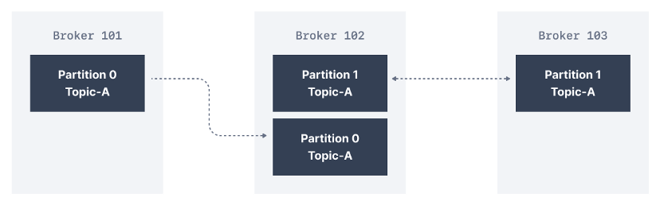

# Kafka - Producer and Consumer

- [Introduction](#introduction)
- [Technology](#technology)
- [Getting started](#getting-started)
  - [Run Kafka locally](#run-kafka-locally)
  - [Confluent Platform](#confluent-platform)
  - [Docker and Docker Compose commands](#docker-and-docker-compose-commands)
- [SSL/TLS Kafka configuration](#ssltls-kafka-configuration)
- [Message Queue vs Streaming (Kafka)](#message-queue-vs-streaming-kafka)
- [Event-driven architecture](#event-driven-architecture)
- [Fault tolerance and Resiliency](#fault-tolerance-and-resiliency)
- [What happens when a new consumer joins the group in Kafka? (rebalancing)](#what-happens-when-a-new-consumer-joins-the-group-in-kafka-rebalancing)
- [To consideration](#to-consideration)
- [Kafka best practises](#kafka-best-practises)
- [Maven commands](#maven-commands)
- [Useful links](#useful-links)

---

## Introduction

Apache Kafka is a framework implementation of a software bus using stream-processing. It is an open-source software platform developed by the Apache Software Foundation written in Scala and Java. The project aims to provide a unified, high-throughput, low-latency platform for handling real-time data feeds.  
<https://en.wikipedia.org/wiki/Apache_Kafka>

Apache Kafka is an open-source distributed event streaming platform used by thousands of companies for high-performance data pipelines, streaming analytics, data integration, and mission-critical applications.  
<https://kafka.apache.org/>


[Reference link](https://hevodata.com/learn/kafka-clusters/)


[Reference link](https://jack-vanlightly.com/blog/2018/9/2/rabbitmq-vs-kafka-part-6-fault-tolerance-and-high-availability-with-kafka)



Kafka Replication Factor refers to the multiple copies of data stored across several Kafka brokers. In the above diagram consisting of three brokers, the replication factor is 2.  
[Reference link](https://blog.clairvoyantsoft.com/steps-to-increase-the-replication-factor-of-a-kafka-topic-a516aefd7e7e)


[Reference link](https://medium.com/@jhansireddy007/how-to-parallelise-kafka-consumers-59c8b0bbc37a)


[Reference link](https://stackoverflow.com/questions/38024514/understanding-kafka-topics-and-partitions)


[Reference link](https://kafka.apache.org/documentation/#intro_topics)


[Reference link](https://kafka.apache.org/081/documentation.html)


[Reference link](https://www.cloudkarafka.com/blog/part1-kafka-for-beginners-what-is-apache-kafka.html)

  

[Reference link](https://docs.datastax.com/en/kafka/doc/kafka/kafkaHowMessages.html)

- Record: Producer sends messages to Kafka in the form of records. A record is a key-value pair. It contains the topic name and partition number to be sent. Kafka broker keeps records inside topic partitions. Records sequence is maintained at the partition level. You can define the logic on which basis partition will be determined.
- Topic: Producer writes a record on a topic and the consumer listens to it. A topic can have many partitions but must have at least one.
- Partition: A topic partition is a unit of parallelism in Kafka, i.e. two consumers cannot consume messages from the same partition at the same time. A consumer can consume from multiple partitions at the same time.
- Offset: A record in a partition has an offset associated with it. Think of it like this: partition is like an array; offsets are like indexs.
- Producer: Creates a record and publishes it to the broker.
- Consumer: Consumes records from the broker.
  - Consumers can:
    - Specify Topic(s) to read data, - Subscribe/Assign
    - Read data (sequentially), - Poll
    - Optional reposition, - Seek
    - Save position (ack processed), - Commit

If you are looking for a book about Kafka, let's have a look on ``Kafka: The Definitive Guide`` which you can get here: <https://www.confluent.io/resources/kafka-the-definitive-guide/>

## Technology

- Kafka
- Confluent Platform for Apache Kafka (7.4.0)
- Maven
- Kotlin
- Java
- AWS Corretto
- Spring Boot 2.x (module `java-spring`) and standalone Kafka libraries (modules `kotlin` and `java`)
- Apache Avro
    - schema-based data serialization library
- Avro Kotlin
    - https://github.com/avro-kotlin/avro4k
    - Limitations: cannot generate a class from .avsc file (it allows on generating a schema based on a Kotlin class).

## Getting started

1. Download the Git repository
2. Install dependencies: `mvn clean install -U`
3. If your IDE doesn't see generated Avro classes, mark `java/java-kafka-producer/target/generated-sources` as `Generated Sources Root`.  
     
4. Run Kafka and Zookeeper - see [Run Kafka locally](#run-kafka-locally)
5. After establishing services, run a producer, run a consumer from:
   1. Standalone Kafka libraries:
       - `java|kotlin/**-kafka-producer`
       - `java|kotlin/**-kafka-consumer`
       - You can also run all at once using `java|kotlin/**-starter` modules for Java/Kotlin.
   2. Spring Boot application:
      - `java-spring/java-spring-starter`
      - You can run the module many times and changing the default port.
6. Follow console output and check the behaviour.
7. Open the Confluent Platform dashboard: `http://localhost:9021/`  
    

### Run Kafka locally

Run Kafka and Zookeeper using Docker Compose.
- `docker-compose up -d --remove-orphans`
  - The default file taken by the command is `docker-compose.yml`

### Confluent Platform

The Confluent setup provides web UI for the whole Kafka platform.  
More information you can find in this guideline: <https://docs.confluent.io/platform/current/quickstart/ce-docker-quickstart.html>


[Reference link](https://docs.confluent.io/platform/current/platform.html)

- **Confluent Control Center** is a web-based tool for managing and monitoring Apache Kafka®. Control Center provides a user interface that allows developers and operators to get a quick overview of cluster health, observe and control messages, topics, and Schema Registry, and to develop and run ksqlDB queries. See more: <https://docs.confluent.io/platform/current/control-center/index.html>


- **Confluent Schema Registry** provides a serving layer for your metadata. It provides a RESTful interface for storing and retrieving your Avro®, JSON Schema, and Protobuf schemas. See more: <https://docs.confluent.io/platform/current/schema-registry/index.html>
- **ksqlDB** is the streaming SQL engine for Kafka. It provides an easy-to-use yet powerful interactive SQL interface for stream processing on Kafka, without the need to write code in a programming language such as Java or Python.

### Docker and Docker Compose commands

If you don't use IDE plugins, here you can find useful Docker commands:
- Show all containers
  - `docker container list`
- Stop a Docker container
  - `docker container stop [container_id]`
- Remove a Docker container
  - `docker container rm [container_id]`
- Build Docker Compose with the default file docker-compose.yml and remove previous containers
  - `docker-compose up -d --remove-orphans`
- Show Docker Compose containers
  - `docker-compose ps`
- Stop all running containers
  - `docker stop $(docker ps -a -q)`
- Delete all stopped containers
  - `docker rm $(docker ps -a -q)`

Reference: <https://www.codenotary.com/blog/extremely-useful-docker-commands/>

## SSL/TLS Kafka configuration

Generate certificates using Confluent script -  [instruction](ssl-tls-example/README-SSL-TLS.md).

Complete TLS/SSL Kafka configuration - [instruction](./secrets/README-SECRETS.md)

## Message Queue vs Streaming (Kafka)

`A message queue`, sometimes called a point-to-point communication, is fairly straightforward. A message queue can have one or more consumers and/or producers. In a message queue with multiple consumers, the queue will attempt to distribute the messages evenly across them, with the guarantee being that every message will only be delivered once.


`A streaming broker` is different from a message queue for many reasons. For starters, messages are organized into log files or topics. One or more consumers can subscribe to a log file or topic to receive all messages that come through that stream. With proper setup, a streaming broker will deliver the same message to every subscriber, in a specific order. This is often described as a publish-subscribe pattern.

While many consumers may be active, queues only deliver messages to a single consumer (typically whichever consumer is available to receive it first) before removing that message from the queue. Meanwhile, streaming brokers send the same message to every subscriber of that log file.

In a queue, once a message is delivered, it's gone forever. To reprocess a message, you have to have a backup, like a batch layer, so that you can put it back into the queue. In comparison, a streaming broker uses a distributed log file, so consumers can move backward and forward within that file to re-process messages they've already received on command.


- https://blog.iron.io/message-queue-vs-streaming/
- https://www.baeldung.com/java-kafka-streams-vs-kafka-consumer

## Event-driven architecture

```text
Event-driven architecture is a software architecture and model for application design. 
With an event-driven system, the capture, communication, processing, and persistence of events are the core structure of the solution. 
This differs from a traditional request-driven model.
```

Event-driven architecture is made up of event producers and event consumers. 
An event producer detects or senses an event and represents the event as a message. 
It does not know the consumer of the event, or the outcome of an event.

### Event-driven architecture models

An event driven architecture may be based on either a pub/sub model or an event stream model.

- `Pub/sub model`
  - This is a messaging infrastructure based on subscriptions to an event stream. With this model, after an event occurs, or is published, it is sent to subscribers that need to be informed.
- `Event streaming model`
  - With an event streaming model, events are written to a log. Event consumers don’t subscribe to an event stream. Instead, they can read from any part of the stream and can join the stream at any time.

References:
- https://blog.ippon.tech/event-driven-architecture-getting-started-with-kafka-part-1/
- https://hevodata.com/learn/kafka-event-driven-architecture/
- https://www.redhat.com/en/topics/integration/what-is-event-driven-architecture
- (recommended) **https://microservices.io/patterns/data/event-driven-architecture.html**

## Fault tolerance and Resiliency

```text
Fault tolerance is the property that enables a system to continue
operating properly in the event of the failure of one or more faults
within some of its components.
```

```text
IT resilience is the ability of an organization to maintain 
acceptable service levels when there is a disruption of business operations, 
critical processes, or your IT ecosystem.
```

- Kafka is sending ACK when a message is completely replicated to all brokers accordingly to settings. The min. insync. replicas is a config on the broker that denotes the minimum number of in-sync replicas required to exist for a broker to allow acks=all requests. If not enough brokers are available, a message cannot be accepted by Kafka.
- The message will be in a buffer for limited time. If it's not published during this time, TimeoutException is thrown.
- An in-sync replica (ISR) is a broker that has the latest data for a given partition. A leader is always an in-sync replica.

```text
void sendSync() throws InterruptedException {
    try {
        Future<RecordMetadata> send = kafkaProducer.send(record);
        log.info("Record metadata: {}",send.get().toString());
    } catch(Exception e){
        if (e.getCause() instanceof TopicAuthorizationException){
            log.error("Not allowed to publish to topic!");
            throw new RuntimeException(e);
        }
        if (e.getCause() instanceof TimeoutException){
            log.error("TimeoutException: "+ e.getMessage());
            if (retries > MAX_RETRIES){
                backoffTime = MAX_TIME;
                log.info("Timeout has been increased to {}", MAX_TIME);
            } else {
                  retries++;
                  log.info("Retries currently at {}", retires);
            }
            Thread.sleep(backoffTime);
            sendSync(record);
        }
    }
}
```

Example error:
```text
(...) retrying (2147483630 attempts left). Error: NOT_ENOUGH_REPLICAS
```

## What happens when a new consumer joins the group in Kafka? (rebalancing)

  

Reference: https://chrzaszcz.dev/2019/06/kafka-rebalancing/

## To consideration

- Async and Sync usage and implications.
- Sending batches vs single record.
- How to ensure message order? Sending one by one and blocking the request (GET on Future) instead of async batches which do not guarantee order.
- Closing the producer.
- Important parameters and implications
  - Ordering
  - Timeout and what does that mean?
  - How/When to retry?
- Threading
  - No thread safe, all I/O happen on caller thread, need synchronization if called from the different thread.
- Polling
  - Keep polling to maintain membership
  - max.poll.interval.ms (default 300s)
  - max.poll.records (default 500)
  - Server side configuration that prevents max.poll.interval.ms
  - "Backpressure can cause consumer to be kicked out"
- Consumer Rebalancing "Rebalancing is the process where a group of consumer instances (belonging to the same group) co-ordinate to own a mutually exclusive set of partitions of topics that the group is subscribed to.
  - Consumer with no heartbeat or not polling within the interval specified.
  - Group coordinator (Broker) not available.
  - Assignment strategy can be configured on client side.
- Offset and Commit
  - Commit can fail - especially if you don't own the partition any more.
  - Offset might not be continuous (example compact strategy is used for topic, or when producer uses transactions).
  - Commit expires after 2 weeks.
  - Default has enable.auto.commit=true
- Subscribe vs Assign
  - Subscribe use group coordination.
  - Commit has additional cost using Subscribe (need to check group ownership).
  - Use Assign lose coordination behaviour but much faster and resilient to lead re-election/coordination failure.
- Clean-up and close
  - Can wake up consumer in Polling (thread safe).
- Important settings
  - ClientId
  - IsolationLevel e.g. read_uncommitted
  - GroupId
  - AutoOffsetResetConfig e.g. earliest
  - EnableAutoCommitConfig
  - MaxPollRecordConfig e.g. 10
  - MaxPollIntervalMsConfig e.g. 15000
  - PartitionAssignmentStrategyConfig e.g. RangeAssignor

## Kafka best practises

- Amazon Managed Streaming for Apache Kafka
  - https://docs.aws.amazon.com/msk/latest/developerguide/bestpractices.html
- Kafka Best Practices-Topic, Partitions, Consumers, Producers and Brokers
  - https://cloudinfrastructureservices.co.uk/kafka-best-practices-topic-partitions-consumers-producers-and-brokers/
- Apache Kafka: Ten Best Practices to Optimize Your Deployment
  - https://www.infoq.com/articles/apache-kafka-best-practices-to-optimize-your-deployment/

## Maven commands

- mvn clean install -DskipTests

#### Release a new version

Run a Maven command using Maven Release plugin:
```text
mvn release:prepare
```

If you want to only update versions (not recommended), use below command:
```text
mvn release:update-versions -DautoVersionSubmodules=true
```


## Useful links

- https://kotlinlang.org/docs/maven.html
- https://github.com/only2dhir/kafkaexample
- https://dzone.com/articles/kafka-producer-and-consumer-example
